# Tutorial Pelatihan Cloud 2024

## Daftar Isi
- [Resource Group](#resource-group)
    - [Membuat Resource Group](#membuat-resource-group)
    - [Role Assignment](#role-assignment)
- [Virtual Machine](#virtual-machine)
    - [Menyewa dan Mengakses Azure VM Windows](#menyewa-dan-mengakses-azure-vm-windows)
    - [Menyewa dan Mengakses Azure VM Linux](#menyewa-dan-mengakses-azure-vm-linux)
    - [Mendeploy Aplikasi di Azure VM](#mendeploy-aplikasi-di-azure-vm)
- [Database](#database)
    - [Membuat Database PostgreSQL di Azure](#membuat-database-postgresql-di-azure)
    - [Mengakses Database PostgreSQL](#mengakses-database-postgresql-melalui-psql-di-vm-ubuntu)

## Resource Group
Setiap resource yang akan kita buat harus terikat kepada suatu resource group. Resource group berguna untuk mengelompokkan resource sejenis sehingga dapat diberi konfigurasi, subscription, dan hak akses serupa. Cara pengelompokan resource bebas mengikuti kebutuhan pengguna.
### Membuat Resource Group
Untuk membuat resource group di microsoft azure, kalian bisa mengikuti langkah-langkah berikut:
1. Pada sidebar tampilan Microsoft Azure, pilih Resource Group dan tekan tombol create.<br>
2. Pada project details, pilih subscription yang ingin digunakan dan masukkan nama resource group.<br>
3. Selanjutnya, masukkan region tempat metadata dari resource group disimpan pada bagian `Resource Details`. Region di sini hanya menunjukkan lokasi metadata resource group dan tidak berhubungan dengan region dari resource yang akan dimasukkan ke dalam resource group. Lokasi resource tetap dapat dipilih secara bebas dan independen dari resource group.<br>
4. Lanjutkan proses `review + create`. Setelah proses selesai, kembali ke menu `Resource Group`. Resource group yang berhasil dibuat akan terlihat.<br>
5. Informasi detail terkait resource group dapat dilihat dengan menekan pilihan resource group yang sesuai.<br>
### Role Assignment
Sebelumnya, telah disinggung bahwa alokasi hak akses dapat dilakukan pada resource group. Sederhananya, alokasi ini dapat membantu suatu tim untuk mengatur apa saja yang bisa dilakukan seseorang sesuai dengan perannya masing-masing. Pada Microsoft Azure, sistem autorisasi ini disebut Azure RBAC (role-based access control) dan berlaku tidak hanya untuk resource group saja, tetapi juga subscription, resource, dll. Langkah-langkah pemberian hak akses pada resource group dapat dilakukan dengan langkah-langkah berikut:
1. Buka menu `Resource Group` dan pilih resource group yang akan dilakukan role assignment. Selanjutnya, pilih menu `Access Control (IAM)`.<br>
2. Klik `Add` dan pilih `Add role assignment` yang berada di bagian kiri atas.<br>
3. Pada bagian `Role`, pilih role yang ingin diberikan. Detail privileges dapat dilihat dengan menekan tombol `view` di kolom `Details`.<br><br>
4. Selanjutnya, pindah ke bagian `Members` untuk menentukan akun yang akan diberi hak akses dengan menekan tombol `select members`.<br>
5. Masukkan akun yang akan diberi hak akses, lalu tekan `select`. Jika sudah, klik `Review + assign`.<br>
6. Untuk melihat role yang telah diberikan, kembali ke tampilan resource group, pilih menu `Access Control (IAM)`, dan pindah ke tab `Role Assignments`.<br>

## Virtual Machine
Microsoft azure menyediakan layanan virtual machine dengan berbagai macam sistem operasi, baik windows maupun linux.
### Menyewa dan Mengakses Azure VM Windows
Menyewa Virtual Machine dengan sistem operasi windows dan mengaksesnya melalui RDP dapat dilakukan dengan mengikuti langkah-langkah berikut:
1. Pada sidebar tampilan Microsoft Azure, pilih Virtual Machines<br>
2. Setelah muncul tampilan menu Virtual Machines, tekan tombol `Create` dan pilih Azure Virtual Machines
3. Masukkan resource group, nama VM, dan region yang sesuai<br>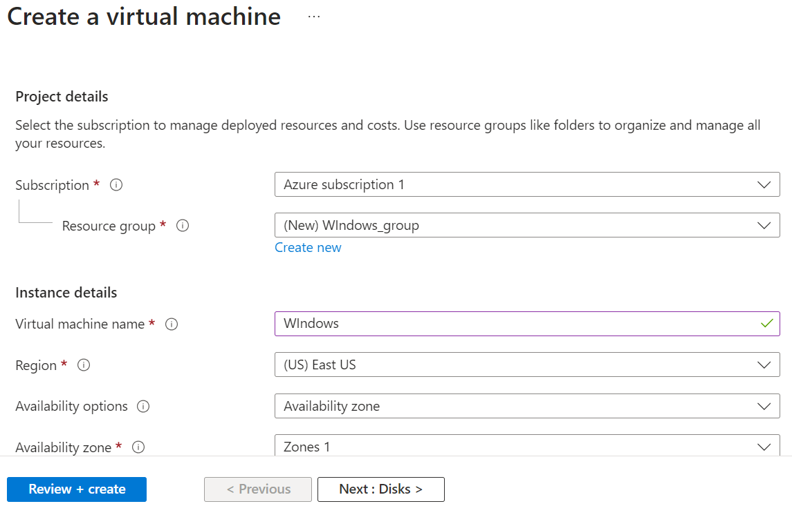
4. Pilih image Windows `Windows Server 2022 Datacenter: Azure Edition - x64 Gen2` dengan size vm `Standard_DS1_v2`<br>
5. Selanjutnya, masukkan username dan password akun administrator untuk menunjang keamanan<br>
6. Pastikan port 3389 (RDP) telah dipilih pada `Indbound Port Rule` agar VM dapat diakses menggunakan RDP<br>
7. Lanjutkan proses `review + create` untuk membuat virtual machine.
8. Setelah VM berhasil dideploy, VM tersebut akan terlihat pada menu `Virtual Machines`.<br>
9. Untuk mengakses, pilih VM windows yang telah dibuat lalu masuk ke bagian `Connect`. Pada menu tersebut, terdapat informasi terkait IP publik, admin username, dan port yang terbuka. Di bagian bawahnya, terdapat pula pilihan Native RDP, pilih `Download RDP file` dan jalankan RDPnya.<br>
10. Tekan connect dan masukkan password akun administrator sesuai yang telah dimasukkan sebelumnya<br>
11. Jika berhasil tersambung, maka kita dapat mengakses VM windows beserta GUI-nya seperti berikut<br>
### Menyewa dan Mengakses Azure VM Linux
Menyewa Virtual Machine dengan sistem operasi windows dan mengaksesnya melalui RDP dapat dilakukan dengan mengikuti langkah-langkah berikut:
1. Pada sidebar tampilan Microsoft Azure, pilih Virtual Machines<br>
2. Setelah muncul tampilan menu Virtual Machines, tekan tombol `Create` dan pilih Azure Virtual Machines
3. Masukkan resource group, nama VM, dan region yang sesuai<br>
4. Pilih image Ubuntu `Ubuntu Server 20.04 LTS - x64 Gen2` dengan size vm `Standard_DS1_v2`.<br>
5. Pada bagian `Administrator Account`, terdapat 2 pilihan tipe autentikasi dengan menggunakan SSH Public Key atau Password. Di sini, kita akan mencoba menggunakan Public Key. Selanjutnya, masukkan username, pilih `Generate new key pair`, dan masukkan nama key-nya.<br>
6. Agar dapat diakses melalui SSH, jangan lupa untuk memilih port 22 (SSH) pada menu `Select inbound ports`.<br>
7. Lanjutkan proses `create` dan jangan lupa untuk mendownload file private key-nya.<br>
8. Setelah VM berhasil dideploy, VM tersebut akan terlihat pada menu `Virtual Machines`.<br>
9. Untuk mengakses, pilih VM windows yang telah dibuat lalu masuk ke bagian `Connect`. Pada menu tersebut, terdapat informasi terkait IP publik, admin username, dan port yang terbuka.
10. Selanjutnya, buka terminal (powershell, cmd, atupun linux terminal) dan `Run as Administrator`.<br>
11. Pada terminal, jalankan `ssh -i <path ke file private key> <admin username>@<IP publik>` seperti berikut:<br>
12. Jika berhasil terkoneksi dengan VM, tampilan akan seperti berikut. Melalui CLI tersebut, kita dapat mengakses file dan mengeksekusi program yang ada di VM.<br>
### Mendeploy Aplikasi di Azure VM
Salah satu fungsi Virtual Machine yang telah kita buat adalah untuk menjalankan aplikasi. Selanjutnya, kita akan mencoba men-deploy aplikasi nodejs dengan langkah-langkah berikut:
1. Agar dapat menerima request `Http`, kita perlu membuka port 80 dengan melakukan pengaturan jaringan.
2. Buka VM Ubuntu yang telah kita buat di Azure Portal, lalu pilih menu `Network settings` pada bagian `Networking`. Scroll hingga masuk ke bagian `Rules`, kemudian pilih `Create port rule` > `Inbound port rule`.
3. Isi `Destination port ranges` dengan 80 dan pilih `TCP` pada bagian `Protocol`. Selanjutnya, klik tombol `Add`.
4. Selanjutnya, akses kembali VM Ubuntu seperti cara sebelumnya.
5. Pada VM, download Web Server Nginx, nodejs, dan npm dengan menjalankan command berikut:<br>
    ```R
    sudo apt-get update
    sudo apt-get install nginx -y
    sudo apt-get install nodejs -y
    sudo apt-get install npm -y
    ```
6. Selanjutnya download source code aplikasi yang ingin dideploy dan letakkan di folder `/var/www/`. Kalian bisa menggunakan aplikasi dari repo `https://github.com/ramamimu/socket.io-NCC.git`. Pindah ke folder `/var/www/` lalu `git clone` menggunakan command berikut:<br>
   ```R
   cd /var/www/
   sudo git clone https://github.com/ramamimu/socket.io-NCC.git
   ```
7. Pindah ke folder `socket.io` lalu install dependecies yang dibutuhkan.<br>
    ```R
    cd /var/www/socket.io/
    sudo npm i
    ```
8. Program dapat dijalankan di latar belakang menggunakan `pm2`
   ```R
   sudo npm install pm2 -g
   pm2 start index.js
   ```
9. Karena program berjalan di port 3000, ubah konfigurasi nginx di file `/etc/nginx/sites-available/default` menjadi sebagai berikut:
    ```R
    server {
        listen 80;
    
        location / {
            proxy_set_header   X-Forwarded-For $remote_addr;
            proxy_set_header   Host $http_host;
            proxy_pass         "http://127.0.0.1:3000";
        }
    }
    ```
10. Restart nginx agar mengikuti konfigurasi yang baru.
    ```R
    systemctl restart nginx
    ```
11. Akses `http:<IP Publik>` pada web browser.<br>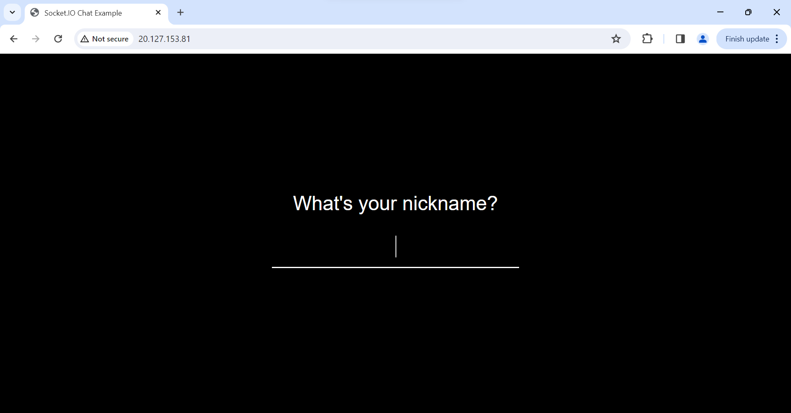

## Database
Microsoft azure memiliki berbagai macam layanan database, baik SQL maupun no SQL. Di sini, kita akan mencoba membuat dan mengakses database postgresql di azure.
### Membuat Database PostgreSQL di Azure
Menyewa dan membuat database postgreSQL dapat dilakukan dengan mengikuti beberapa langkah berikut:
1. Buka menu `Create a Resource` yang ada di sidebar lalu cari `postgresql` menggunakan search bar `Search services and marketplace`.<br>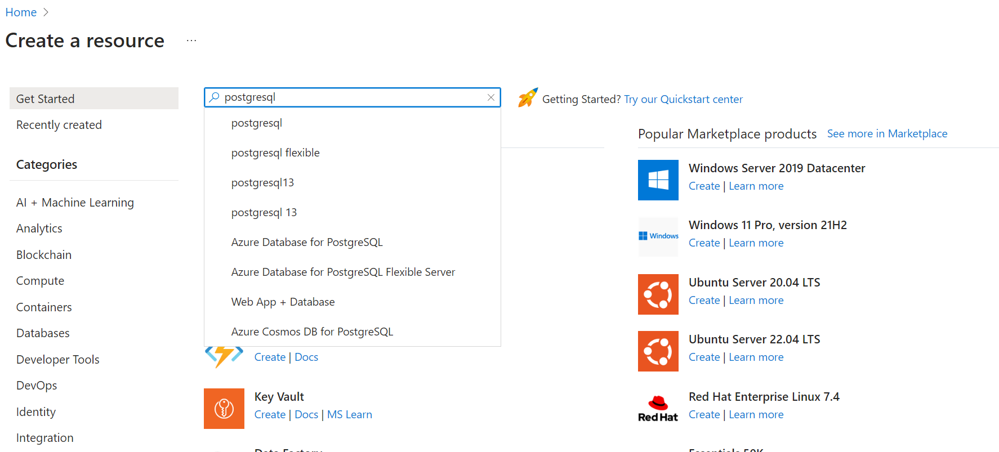
2. Pilih `Azure Database for PostgreSQL Flexible Server` dan klik pada tombol `Create`.<br>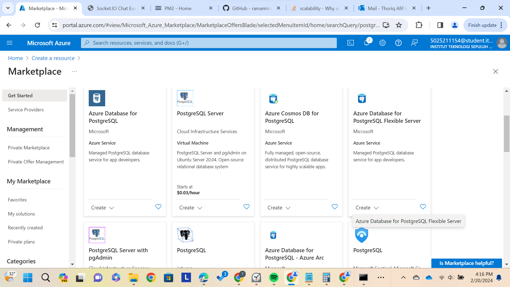
3. Pilih dan masukkan resource group, nama server serta region yang sesuai.<br>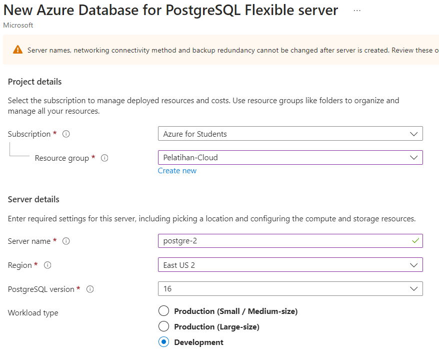
4. Pada bagian `compute + storage`, klik `configure server`.<br>
5. Pilih `Burstable` pada `Compute tier`, 'Standard_B1ms' pada `Compute size`, `32 GiB` pada `Storage size`, dan `P4 (120 iops)` pada `Performance Tier`. Jika sudah, tekan `save`.<br>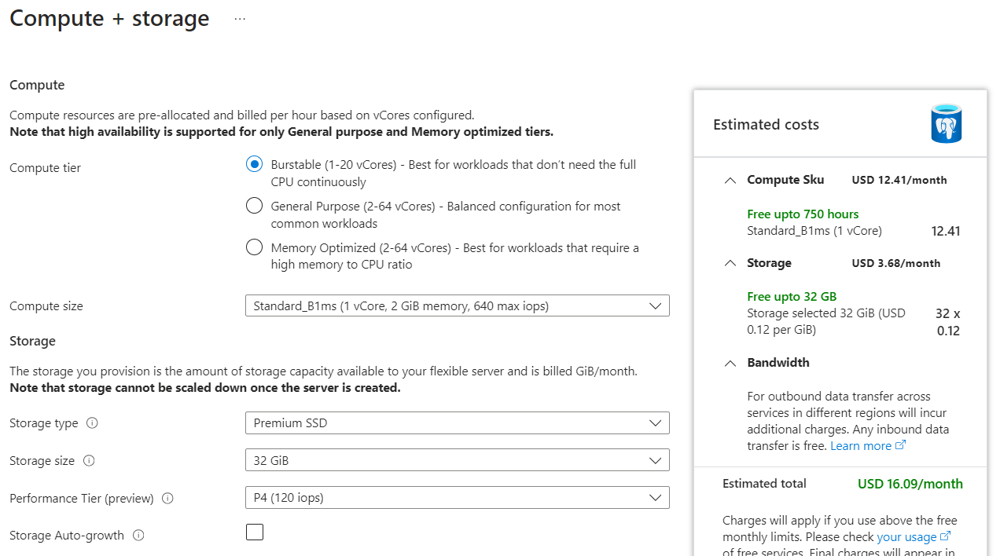
6. Masukkan admin username dan password pada bagian autentikasi, lalu lanjutkan proses `Review + create`.<br>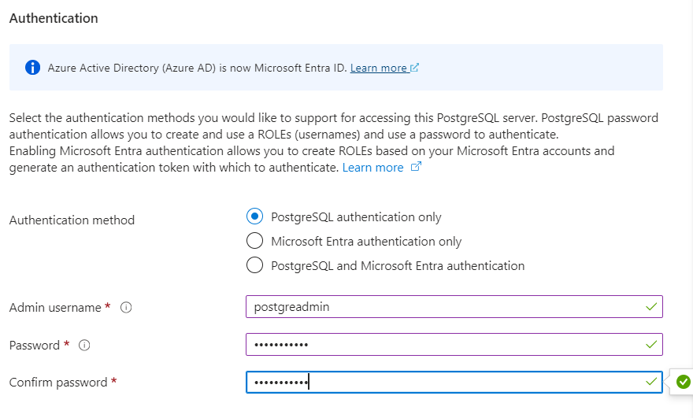
### Mengakses Database PostgreSQL melalui psql di VM Ubuntu
Pada bagian ini, kita akan mencoba mengakses database dari VM dengan menggunakan psql (CLI untuk postgreSQL). Akses ke database dapat dilakukan dengan langkah-langkah berikut:
1. Buka postgreSQL pada Azure Portal kemudian pilih menu networking.<br>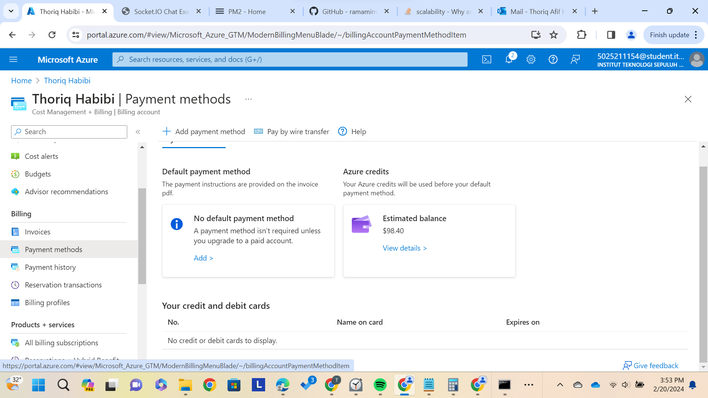
2. Akses ke database dibatasi untuk IP tertentu. Karenanya, kita perlu menambahkan IP VM pada Firewall Rules yang ada pada menu networking. Isi kolom `start ip address` dan `end ip address` dengan IP dari VM yang telah kita buat. Kemudian, kita perlu menyimpan konfigurasi firewall dengan menekan tombol save yang ada di sebelah kiri atas.<br>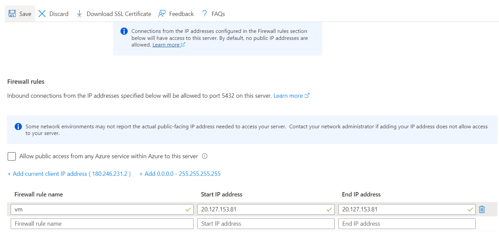
3. Selanjutnya, pilih menu `connect`. Di situ tersedia beberapa cara akses ke database.<br>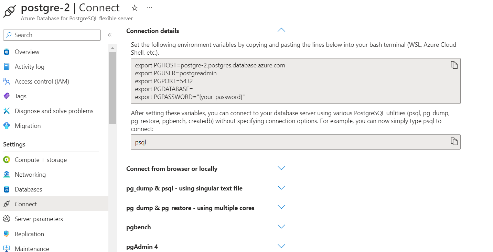
4. Command untuk mengakses database melalui VM dapat dilihat pada bagian `Connect from browser or locally`.
5. Akses VM dan download psql dengan command berikut
    ```R
    sudo apt-get update
    sudo apt-get install postgresql -y
    wget --no-check-certificate https://dl.cacerts.digicert.com/DigiCertGlobalRootCA.crt.pem
    ```
6. Akses database berdasarkan command di poin 4 dengan menambahkan database yang ingin diakses, kemudian masukkan password yang sesuai.<br>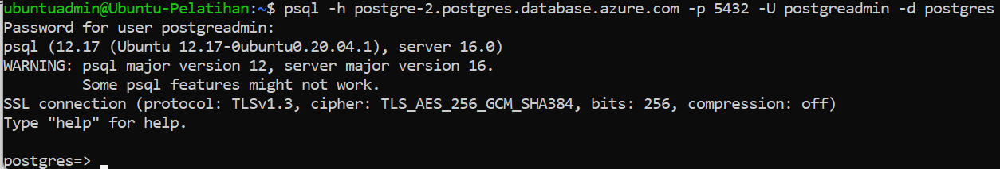
Selain menggunakan psql, kita juga dapat mengakses melalui pgAdmin dengan mengikuti langkah-langkah yang ada pada menu `Connect` > `pgAdmin4`<br>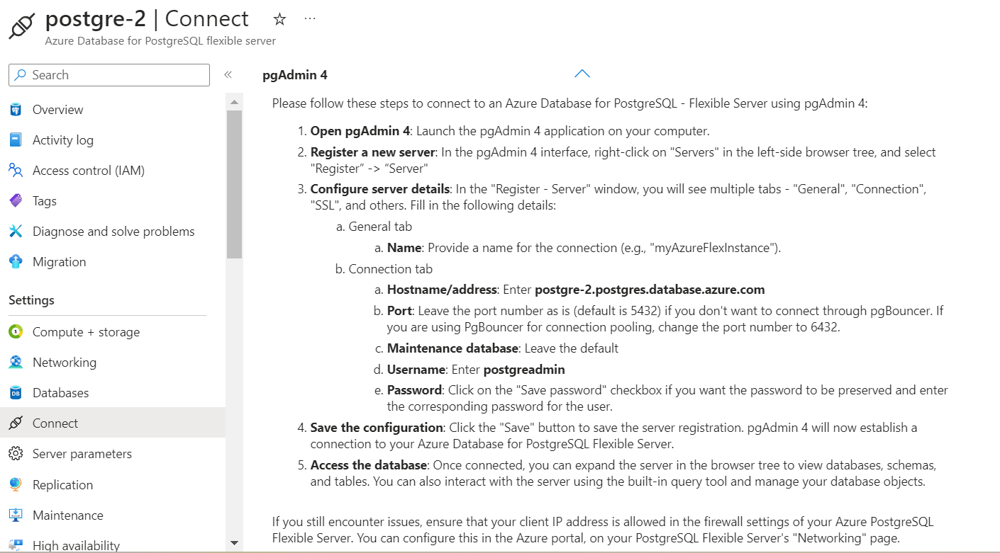
